# FIAP - Faculdade de Informática e Administração Paulista

<p align="center">
<a href= "https://www.fiap.com.br/"></a>
</p>

<br>


# Projeto: fiap_fase3_cap1-novo

## Atividade em Grupo: FIAP - 1TIAOB - 2025/1 - Fase3 Cap1

## 👨‍🎓 Integrantes: 
- <a href="">Alice C. M. Assis - RM 566233</a>
- <a href="">Leonardo S. Souza - RM 563928</a>
- <a href="">Lucas B. Francelino - RM 561409</a> 
- <a href="">Pedro L. T. Silva - RM 561644</a> 
- <a href="">Vitor A. Bezerra - RM 563001</a>

## 👩‍🏫 Professores:
### Tutor(a) 
- <a href="proflucas.moreira@fiap.com.br">Lucas Gomes Moreira</a>
### Coordenador(a)
- <a href="profandre.chiovato@fiap.com.br">André Godoi Chiovato</a>


## 📜 Descrição

Nesta etapa, a FarmTech Solutions implementa um sistema de irrigação inteligente com sensores de umidade, nutrientes e pH, capazes de acionar automaticamente a bomba de irrigação conforme os dados coletados. As informações são armazenadas em um banco de dados SQL, permitindo visualização e análises estatísticas dos resultados.

## Objetivos do projeto:

- Herança da Fase 3: Realizar um fork do projeto da Fase 3 (https://github.com/Hinten/fiap_fase3_cap1-novo)[https://github.com/Hinten/fiap_fase3_cap1-novo] com as melhorias solicitadas no enunciado;
- Código C/C++ otimizado: Entregar um código revisado e otimizado para o ESP32, gerenciando sensores e exibindo dados no display LCD;
- Banco de dados: Aprimorar o banco de dados, revisando e atualizando o modelo de negócio da FarmTech Solutions;
- Código Python com Scikit-learn e Streamlit: Implementar a modelagem preditiva utilizando Scikit-learn e uma interface interativa com Streamlit;
- Integração do Serial Plotter: Demonstrar o uso do Serial Plotter com prints do Wokwi para monitoramento das variáveis, insira e explicar os prints no README;
- Documentação e atualização no GitHub: Atualizar o repositório com documentação detalhada no README, incluindo explicações das melhorias, imagens e prints;
- Vídeo: Gravar um vídeo de até 5 minutos mostrando o funcionamento do sistema atualizado.


## Entrega 1: Sistema de Sensores e Controle com ESP32

### 1️⃣ Circuito de sensores

O circuito de sensores foi atualizado, com os seguintes componentes:

<p align="center"></p>

Abaixo estão os componentes utilizados:
- 1x ESP32
- 1x Sensor LDR representando o Sensor de pH
- 1x Sensor de temperatura e umidade DHT22
- 1x Botão representando o Sensor de Fósforo
- 1x Botão representando o Sensor de Potássio
- 1x Relé
- 1x Led representando a bomba d'água
- 1x Tela LCD para visualizar os dados dos sensores

### Código do ESP32

O código do ESP32 foi atualizado, e pode ser encontrado no arquivo [sketch.cpp](src/wokwi/src/sketch.cpp). 
O código é responsável por monitorar a necessidade de irrigação em uma plantação, simulando sensores de nutrientes e condições ambientais.
A versão anterior pode ser encontrada no arquivo [sketch.ino](src/wokwi/old/sketch.ino). 
Segue abaixo a explicação do código atualizado e melhorias em relação a versão anterior

## Funcionamento

O sistema de irrigação inteligente passou por uma grande evolução na transição do código `sketch.ino` para o novo `sketch.cpp`. Abaixo, destacamos as principais mudanças e melhorias implementadas:

### Principais melhorias do `sketch.cpp` em relação ao `sketch.ino`

- **Estrutura e Organização:**
  - O código foi modularizado, com funções separadas para conexão Wi-Fi, envio de dados à API, atualização do display LCD e registro no Serial Monitor, facilitando manutenção e expansão.
  - Uso de `constexpr` e tipos explícitos para definição de pinos e constantes, aumentando a clareza e segurança.

- **Integração com Rede e API:**
  - O ESP32 conecta-se automaticamente ao Wi-Fi e envia dados dos sensores para uma API remota, que pode decidir sobre a irrigação de forma centralizada e inteligente.
  - O sistema consulta a API para saber se deve irrigar, tornando a decisão mais robusta e baseada em dados externos.

- **Lógica de Decisão Otimizada:**
  - A lógica local de ativação da irrigação foi mantida, mas agora é possível priorizar a resposta da API, tornando o sistema híbrido (local + remoto).
  - O cálculo do pH simulado pelo LDR foi aprimorado: agora o valor é convertido proporcionalmente para a escala real de pH (0 a 14), tornando a simulação mais fiel.
  - A contagem de condições críticas foi simplificada e otimizada, tornando o código mais enxuto e eficiente.

- **Interface e Feedback ao Usuário:**
  - Inclusão de display LCD I2C para exibir, em tempo real, umidade, pH, estado dos nutrientes e status da irrigação.
  - Mensagens mais claras e resumidas no Serial Monitor, facilitando o acompanhamento e debug.

- **Robustez e Manutenção:**
  - Funções auxiliares centralizam a atualização das saídas (LCD e Serial), facilitando futuras manutenções.
  - O tratamento dos botões foi refinado para evitar leituras falsas, com debounce otimizado e variáveis de estado bem definidas.

- **Identificação e Expansão:**
  - O ESP32 envia seu ID único para a API, permitindo rastreabilidade e controle individualizado dos sensores.
  - O código está preparado para integração com novos sensores, atuadores e funcionalidades futuras.

#### Resumo das principais diferenças

| Aspecto                  | Versão Anterior (`sketch.ino`) | Versão Atual (`sketch.cpp`)         |
|--------------------------|---------------------------------|-------------------------------------|
| Organização              | Código monolítico               | Modularizado, funções separadas     |
| Rede/API                 | Não possui                      | Integração Wi-Fi e API remota       |
| Display                  | Não possui                      | LCD I2C com dados em tempo real     |
| Decisão de irrigação     | Apenas local                    | Local + consulta à API              |
| Conversão de pH          | Simples (divisão por 100)       | Proporcional à escala real (0-14)   |
| Robustez                 | Básica                          | Debounce otimizado, logs claros     |
| Expansibilidade          | Limitada                        | Estrutura pronta para expansão      |

Essas melhorias tornam o sistema mais inteligente, confiável, fácil de manter e pronto para integração com soluções de agricultura digital e IoT.

---


### Exemplos de Trechos do Código

- **Definição dos pinos dos sensores e atuadores (agora com constexpr e tipos explícitos):**
  ```cpp
  constexpr uint8_t BUTTON_P      = 5;   // Botão fósforo (GPIO5)
  constexpr uint8_t BUTTON_K      = 4;   // Botão potássio (GPIO4)
  constexpr uint8_t LDR_PIN       = 32;  // Pino LDR (GPIO32)
  constexpr uint8_t DHTPIN        = 12;
  constexpr uint8_t RELAY_PIN     = 25;
  constexpr uint8_t LED_PIN       = 2;
  constexpr uint8_t BUTTON_API    = 18;
  constexpr auto    DHTTYPE       = DHT22;
  ```

- **Leitura dos sensores e botões (com debounce otimizado):**
  ```cpp
  uint8_t leituraAtual = digitalRead(BUTTON_P);
  if(leituraAtual == LOW && ultimoEstadoFosforo == HIGH) {
    estadoFosforo = !estadoFosforo;
    delay(150);  // Debounce reduzido
  }
  ultimoEstadoFosforo = leituraAtual;

  leituraAtual = digitalRead(BUTTON_K);
  if(leituraAtual == LOW && ultimoEstadoPotassio == HIGH) {
    estadoPotassio = !estadoPotassio;
    delay(150);
  }
  ultimoEstadoPotassio = leituraAtual;

  uint16_t ldrValue = analogRead(LDR_PIN);  // 0-4095
  float umidade = dht.readHumidity();
  float phSimulado = (ldrValue / 4095.0f) * 14.0f; // Conversão proporcional pH
  ```

- **Lógica de decisão para acionar a irrigação (local + API):**
  ```cpp
  uint8_t condicoesCriticas = 0;
  condicoesCriticas += !estadoFosforo;
  condicoesCriticas += !estadoPotassio;
  condicoesCriticas += (ldrValue > 700);
  condicoesCriticas += (umidade < 60.0f);

  bool irrigacaoAtiva_local = condicoesCriticas >= 2;

  // Envio dos dados para API e consulta decisão remota
  int resposta_irrigacao = should_irrigate(doc);
  bool irrigacaoAtiva = irrigacaoAtiva_local;
  if (resposta_irrigacao != -1) {
    irrigacaoAtiva = resposta_irrigacao == 1;
  }

  digitalWrite(RELAY_PIN, irrigacaoAtiva);
  digitalWrite(LED_PIN, irrigacaoAtiva);
  ```

- **Atualização do display LCD e log no Serial Monitor:**
  ```cpp
  void atualizarLCD(float& umidade, float& ph, bool& irrigStatus) {
    lcd.clear();
    lcd.setCursor(0, 0);
    lcd.print(F("U:"));
    lcd.print(umidade, 1);
    lcd.print(F("% pH:"));
    lcd.print(ph, 1);
    lcd.setCursor(0, 1);
    lcd.print(F("F:"));
    lcd.print(estadoFosforo ? F("Y") : F("N"));
    lcd.print(F(" K:"));
    lcd.print(estadoPotassio ? F("Y") : F("N"));
    lcd.print(F(" I:"));
    lcd.print(irrigStatus ? F("ON") : F("--"));
  }
  ```

- **Envio de dados para API e identificação do dispositivo:**
  ```cpp
  char chipidStr[17];
  void iniciar_sensor() {
    uint64_t chipid = ESP.getEfuseMac();
    sprintf(chipidStr, "%016llX", chipid);
    JsonDocument doc;
    doc["serial"] = chipidStr;
    post_data(doc, init_sensor);
  }
  ```
  
- **Exemplo de condição crítica:**
  - LDR (pH): `ldrValue > 7` (Foi aplicado um fator de ÷100 na saída do LDR, para simular o valor do pH que varia de 0 a 14)
  - Umidade: `umidade < 60`
  - Fósforo e Potássio: botões desligados


- **Valores possíveis para cada sensor:**
  - LDR (pH): `0 a 14` (condição: 0 a 7 = 1 positivo, 8 a 14 = 0 negativo)
  - Umidade: `de 0 a 100%` (condição: 0 a 59 = 0 negativo, 60 a 100 = 1 positivo)
  - Botão (Fósforo): `0 ou 1` (condição: 0 negativo, 1 positivo)
  - Botão (Potássio): `0 ou 1` (condição: 0 negativo, 1 positivo)
  - Relé (Irrigação): `0 ou 1` (consição: 0 ligado, 1 desligado)
  - Botão (API): `0 ou 1` (previsão: 0 não vai chover, 1 vai chover)


- **Todas as condições possíveis (API = 0):**
  - 01 - (Fósforo = 0 / Potássio = 0 / pH = 0 / Umidade = 0) = Ligar Irrigação
  - 02 - (Fósforo = 0 / Potássio = 0 / pH = 0 / Umidade = 1) = Ligar Irrigação
  - 03 - (Fósforo = 0 / Potássio = 0 / pH = 1 / Umidade = 0) = Ligar Irrigação
  - 04 - (Fósforo = 0 / Potássio = 0 / pH = 1 / Umidade = 1) = Ligar Irrigação
  - 05 - (Fósforo = 0 / Potássio = 1 / pH = 0 / Umidade = 0) = Ligar Irrigação
  - 06 - (Fósforo = 0 / Potássio = 1 / pH = 0 / Umidade = 1) = Ligar Irrigação
  - 07 - (Fósforo = 0 / Potássio = 1 / pH = 1 / Umidade = 0) = Ligar Irrigação
  - 08 - (Fósforo = 0 / Potássio = 1 / pH = 1 / Umidade = 1) = Desligar Irrigação
  - 09 - (Fósforo = 1 / Potássio = 0 / pH = 0 / Umidade = 0) = Ligar Irrigação
  - 10 - (Fósforo = 1 / Potássio = 0 / pH = 0 / Umidade = 1) = Ligar Irrigação
  - 11 - (Fósforo = 1 / Potássio = 0 / pH = 1 / Umidade = 0) = Ligar Irrigação
  - 12 - (Fósforo = 1 / Potássio = 0 / pH = 1 / Umidade = 1) = Desligar Irrigação
  - 13 - (Fósforo = 1 / Potássio = 1 / pH = 0 / Umidade = 0) = Ligar Irrigação
  - 14 - (Fósforo = 1 / Potássio = 1 / pH = 0 / Umidade = 1) = Desligar Irrigação
  - 15 - (Fósforo = 1 / Potássio = 1 / pH = 1 / Umidade = 0) = Desligar Irrigação
  - 16 - (Fósforo = 1 / Potássio = 1 / pH = 1 / Umidade = 1) = Desligar Irrigação

### Demonstração dos resultados do circuito:

* Todos o sensores do circuito apresentando resultados <u>positivos</u>:
<p align="center">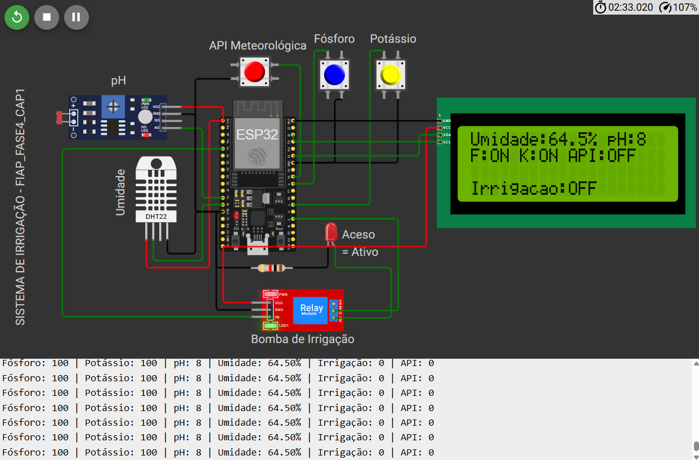</p>

* Todos os sensores do circuito apresentando resultados <u>negativos</u>:
<p align="center">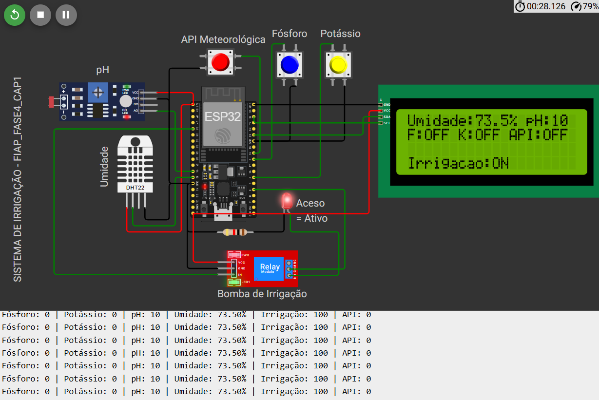</p>

### Conexão com a API

O lançamento dos dados do monitor serial no sistema em Python será mostrado no vídeo abaixo, após a explicação do sistema e operações CRUD.

---

### 2️⃣ Demonstração do Serial Plotter

Para monitorar o comportamento do circuito e acompanhar o resultado dos sensores demonstramos abaixo alguns cenários.

### SERIAL PLOTTER

Foram criadas algumas condições apresentadas na leitura dos sensores de pH e Umidade, como: Oscilação Estável, Oscilação Varível, Variação para cima e Variação para Baixo. (Obs: Comparamos apenas pH e Umidade, pors são os únicos sensores dos nosso circuito que não oscilavam apenas entre 0 e 1):
* Azul = Umidade
* Rosa = pH

<br>
* <strong>Oscilação Estável:</strong> Pouca variação de umidade e pouca variação de pH.
<p align="center">
  <b>Gráfico</b><br>
  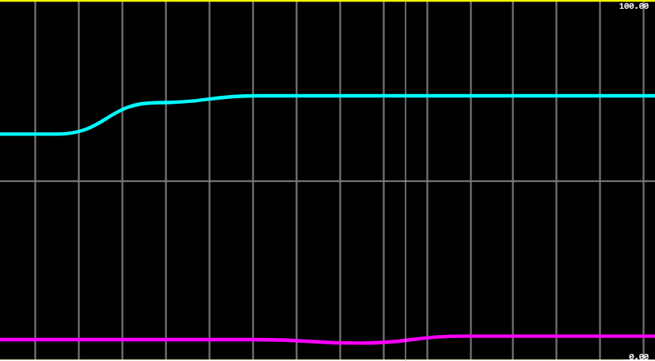
</p>

<p align="center">
  <b>Dados</b><br>
  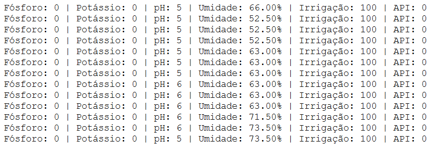
</p>


<br>
* <strong>Oscilação Variável:</strong> Muita variação de umidade que influencia em uma grande variação de pH.
<p align="center">
  <b>Gráfico</b><br>
  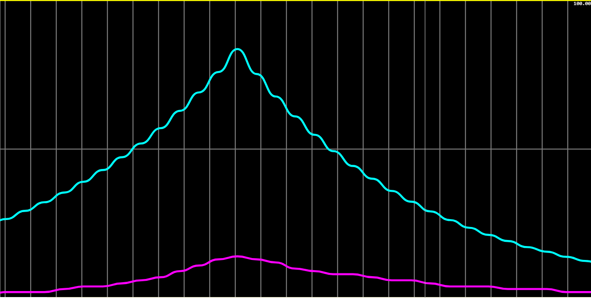
</p>

<p align="center">
  <b>Dados</b><br>
  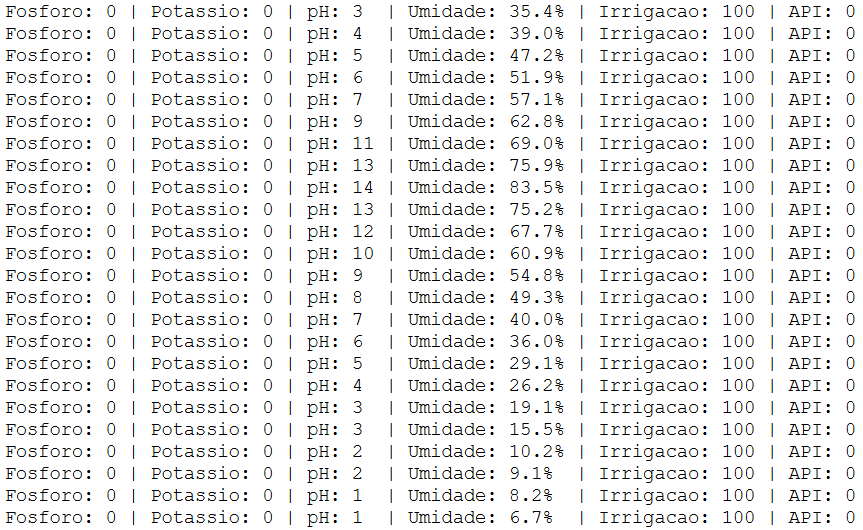
</p>


<br>
* <strong>Variação para Cima:</strong> O aumento da umidade influenciou no aumento do pH.
<p align="center">
  <b>Gráfico</b><br>
  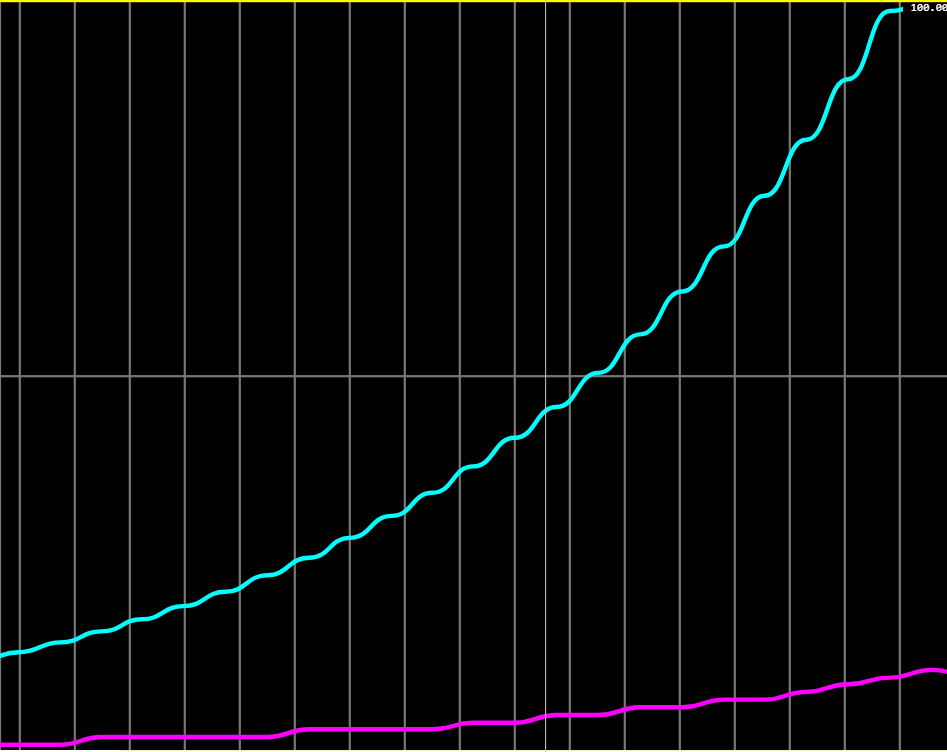
</p>

<p align="center">
  <b>Dados</b><br>
  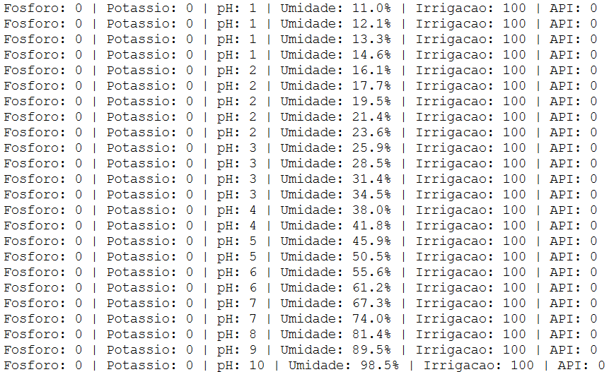
</p>

<br>
* <strong>Variação para Baixo:</strong> O queda da umidade influenciou na redução do pH.
<p align="center">
  <b>Gráfico</b><br>
  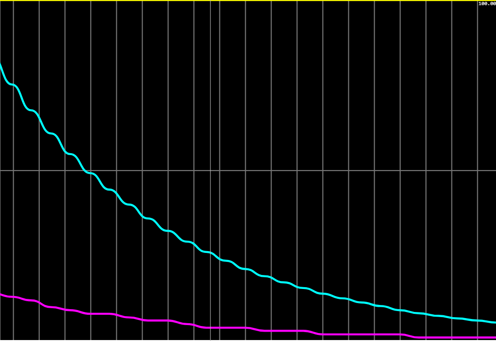
</p>

<p align="center">
  <b>Dados</b><br>
  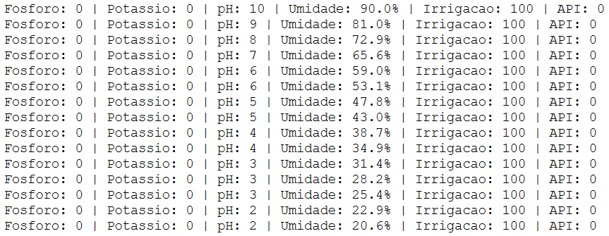
</p>

---

### 3️⃣ Armazenamento de Dados em Banco SQL com Python

O armazenamento dos dados coletados pelos sensores foi implementado em Python, utilizando um banco de dados SQL. O código é responsável por criar tabelas, inserir dados e realizar operações CRUD (Criar, Ler, Atualizar e Deletar) no banco de dados.

### MER

O grupo teve que fazer algumas alterações em relação ao modelo de banco de dados apresentado na entrega anterior [treino258/fiap_fase2_cap1](https://github.com/treino258/fiap_fase2_cap1), para que ele se adequasse a nova proposta do projeto. O modelo abaixo representa as novas tabelas criadas para o armazenamento dos dados:

<p align="center">
  <b>Antigo</b><br>
  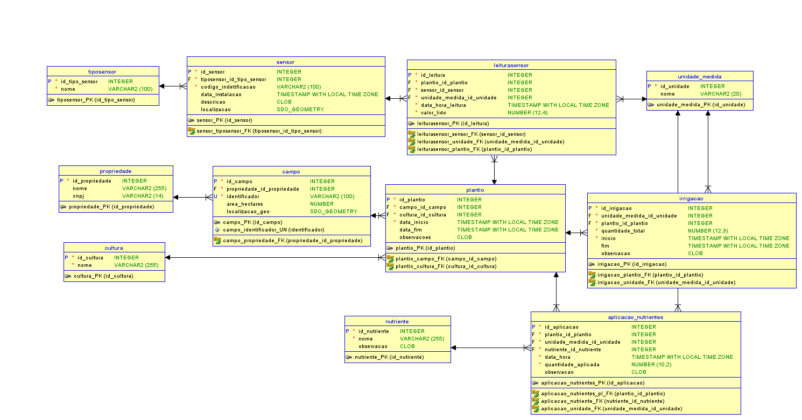
</p>
<br>
<p align="center">
  <b>Novo</b><br>
  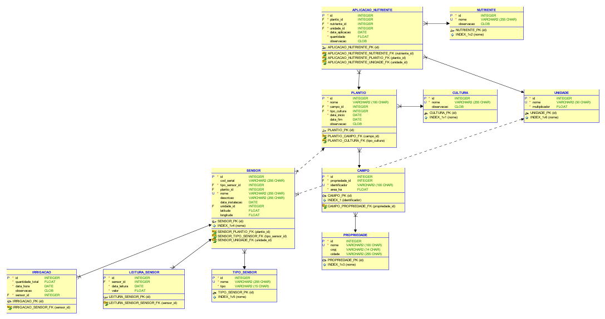
</p>


Novo Modelo de Entidade-Relacionamento:

Tabela: CULTURA
  - id (INTEGER NOT NULL) [PK]
  - nome (VARCHAR(255) NOT NULL)
  - observacao (TEXT(1000))

Tabela: PROPRIEDADE
  - id (INTEGER NOT NULL) [PK]
  - nome (VARCHAR(100) NOT NULL)
  - cnpj (VARCHAR(14))

Tabela: CAMPO
  - id (INTEGER NOT NULL) [PK]
  - propriedade_id (INTEGER NOT NULL) [FK -> PROPRIEDADE]
  - identificador (VARCHAR(100) NOT NULL)
  - area_ha (FLOAT NOT NULL)

Tabela: PLANTIO
  - id (INTEGER NOT NULL) [PK]
  - nome (VARCHAR(100) NOT NULL)
  - campo_id (INTEGER NOT NULL) [FK -> CAMPO]
  - tipo_cultura (INTEGER NOT NULL) [FK -> CULTURA]
  - data_inicio (DATETIME NOT NULL)
  - data_fim (DATETIME)
  - observacao (TEXT(1000))

Tabela: UNIDADE
  - id (INTEGER NOT NULL) [PK]
  - nome (VARCHAR(50) NOT NULL)
  - multiplicador (FLOAT NOT NULL)

Tabela: TIPO_SENSOR
  - id (INTEGER NOT NULL) [PK]
  - nome (VARCHAR(255) NOT NULL)
  - tipo (VARCHAR(15) NOT NULL)

Tabela: SENSOR
  - id (INTEGER NOT NULL) [PK]
  - tipo_sensor_id (INTEGER NOT NULL) [FK -> TIPO_SENSOR]
  - plantio_id (INTEGER NOT NULL) [FK -> PLANTIO]
  - nome (VARCHAR(255) NOT NULL)
  - descricao (VARCHAR(255))
  - data_instalacao (DATETIME)
  - unidade_id (INTEGER) [FK -> UNIDADE]
  - latitude (FLOAT)
  - longitude (FLOAT)

Tabela: LEITURA_SENSOR
  - id (INTEGER NOT NULL) [PK]
  - sensor_id (INTEGER NOT NULL) [FK -> SENSOR]
  - data_leitura (DATETIME NOT NULL)
  - valor (FLOAT NOT NULL)

Tabela: IRRIGACAO
  - id (INTEGER NOT NULL) [PK]
  - quantidade_total (FLOAT NOT NULL)
  - data_hora (DATETIME NOT NULL)
  - observacao (TEXT(1000))
  - sensor_id (INTEGER NOT NULL) [FK -> SENSOR]

Tabela: NUTRIENTE
  - id (INTEGER NOT NULL) [PK]
  - nome (VARCHAR(255) NOT NULL)
  - observacao (TEXT(1000))

Tabela: APLICACAO_NUTRIENTE
  - id (INTEGER NOT NULL) [PK]
  - plantio_id (INTEGER NOT NULL) [FK -> PLANTIO]
  - nutriente_id (INTEGER NOT NULL) [FK -> NUTRIENTE]
  - unidade_id (INTEGER NOT NULL) [FK -> UNIDADE]
  - data_aplicacao (DATETIME NOT NULL)
  - quantidade (FLOAT NOT NULL)
  - observacao (TEXT(1000))

## Resumo das mudanças entre o modelo antigo e o novo

### Alterações Removidas
1. **Tabelas e Colunas**:
   - A tabela `aplicacao_nutrientes` foi removida, incluindo suas colunas:
     - `id_aplicacao`, `plantio_id_plantio`, `unidade_medida_id_unidade`, `nutriente_id_nutriente`, `data_hora`, `quantidade_aplicada`, `observacao`.
   - A tabela `leiturasensor` foi removida, incluindo suas colunas:
     - `id_leitura`, `plantio_id_plantio`, `sensor_id_sensor`, `unidade_medida_id_unidade`, `data_hora_leitura`, `valor_lido`.
   - A tabela `unidade_medida` foi removida, incluindo suas colunas:
     - `id_unidade`, `nome`.

2. **Relacionamentos**:
   - Relacionamentos envolvendo as tabelas removidas (`aplicacao_nutrientes`, `leiturasensor`, `unidade_medida`) foram eliminados.

3. **Colunas Específicas**:
   - A coluna `localizacao_geo` foi removida da tabela `campo`.
   - A coluna `localizacao` foi removida da tabela `sensor`.

### Alterações Adicionadas
1. **Tabelas e Colunas**:
   - Novas tabelas foram adicionadas:
     - `APLICACAO_NUTRIENTE` com colunas: `id`, `plantio_id`, `nutriente_id`, `unidade_id`, `data_aplicacao`, `quantidade`, `observacao`.
     - `LEITURA_SENSOR` com colunas: `id`, `sensor_id`, `data_leitura`, `valor`.
     - `UNIDADE` com colunas: `id`, `nome`, `multiplicador`.

2. **Relacionamentos**:
   - Novos relacionamentos foram criados para as tabelas adicionadas:
     - `APLICACAO_NUTRIENTE` agora referencia `PLANTIO`, `NUTRIENTE` e `UNIDADE`.
     - `LEITURA_SENSOR` agora referencia `SENSOR`.

3. **Colunas Específicas**:
   - A tabela `CAMPO` agora possui a coluna `area_ha` em vez de `area_hectares`.
   - A tabela `SENSOR` agora possui as colunas `latitude` e `longitude`.

### Alterações Gerais
- Os nomes das tabelas e colunas foram padronizados para maiúsculas no novo modelo.
- Tipos de dados foram ajustados:
  - `TIMESTAMP` foi substituído por `DATE` em várias tabelas.
  - `NUMBER` foi substituído por `FLOAT` em colunas numéricas.
- Restrições de chave primária e única foram mantidas ou ajustadas para refletir as mudanças nas tabelas e colunas.

Essas alterações refletem uma reorganização e simplificação do modelo de dados, com a remoção de tabelas e colunas redundantes e a introdução de novas estruturas mais alinhadas às necessidades do sistema.

### JUSTIFICATIVA DA ESCOLHA DA ESTRUTURA DE DADOS

A estrutura de dados foi projetada para atender às necessidades de um sistema de gerenciamento agrícola, garantindo flexibilidade, escalabilidade e consistência. Abaixo estão os principais pontos que justificam as escolhas realizadas:

1. **Normalização e Organização**:
   - O modelo segue os princípios de normalização para evitar redundância de dados e garantir integridade referencial.
   - As tabelas foram organizadas de forma a refletir entidades reais do domínio agrícola, como `PLANTIO`, `CAMPO`, `SENSOR` e `NUTRIENTE`.

2. **Flexibilidade**:
   - A inclusão de tabelas como `UNIDADE` e `TIPO_SENSOR` permite a adição de novos tipos de sensores ou unidades de medida sem a necessidade de alterações estruturais significativas.
   - A tabela `OBSERVACAO` em várias entidades permite armazenar informações adicionais sem comprometer a estrutura principal.

3. **Escalabilidade**:
   - O uso de tipos de dados como `FLOAT` e `CLOB` garante que o sistema possa lidar com grandes volumes de dados e informações detalhadas.
   - A separação de tabelas como `LEITURA_SENSOR` e `APLICACAO_NUTRIENTE` permite o registro de eventos históricos, facilitando análises futuras.

4. **Padronização**:
   - Os nomes das tabelas e colunas foram padronizados em maiúsculas para facilitar a leitura e manter consistência.
   - Tipos de dados foram escolhidos com base nas melhores práticas para bancos de dados Oracle, como o uso de `DATE` para datas e `VARCHAR2` para strings.

5. **Relacionamentos Claros**:
   - A utilização de chaves estrangeiras garante a integridade dos dados e define claramente os relacionamentos entre as entidades.
   - Por exemplo, a tabela `PLANTIO` referencia `CAMPO` e `CULTURA`, enquanto `SENSOR` referencia `TIPO_SENSOR` e `PLANTIO`.

6. **Adaptação às Necessidades do Domínio**:
   - A estrutura foi adaptada para refletir as operações agrícolas, como o registro de leituras de sensores, aplicações de nutrientes e irrigação.
   - A inclusão de colunas como `latitude` e `longitude` em `SENSOR` permite a localização geográfica precisa, essencial para análises espaciais.

Essa estrutura foi escolhida para garantir que o sistema seja robusto, fácil de manter e capaz de atender às demandas de um ambiente agrícola em constante evolução.

### EXECUTAR O SISTEMA E REALIZAR OPERAÇÕES CRUD

O sistema foi desenvolvido em Python e utiliza um banco de dados Oracle para armazenar os dados. O código é modularizado, permitindo fácil manutenção e expansão.

## 📦 Requisitos
- Python 3.13.2
- Bibliotecas:
  - oracledb==3.1.0
  - pandas==2.2.3
  - matplotlib==3.10.1
  - streamlit==1.44.1
  - SQLAlchemy==2.0.40

## 🔗 Instalação
- Para instalar as dependências, utilize o seguinte comando:
    ```bash
    pip install -r requirements.txt
    ```
  
- Para executar o código, utilize o seguinte comando:
    ```bash
    streamlit run main_dash.py
    ```
    > **Nota:** O código foi desenvolvido para rodar em ambiente local, utilizando o Streamlit.

## Login

- O sistema requer um login para acessar as funcionalidades. O usuário e senha devem ser fornecidos no início da execução.

<p align="center">
  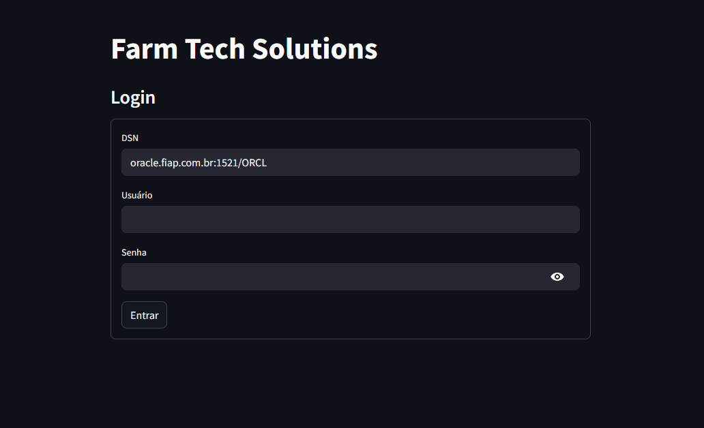
</p>

- DSN: `oracle.fiap.com.br:1521/ORCL`
- Usuário: `seu usuario no banco de dados da FIAP`
- Senha: `sua senha no banco de dados da FIAP`

- Após o login, o usuário será direcionado para a tela inicial do sistema.

## Realizando operações CRUD
- O sistema permite realizar operações CRUD (Criar, Ler, Atualizar e Deletar) em todas as tabelas do banco de dados.
- As operações são realizadas através de formulários, onde o usuário pode inserir os dados necessários.
- Após a inserção dos dados, o sistema irá validar as informações e realizar a operação no banco de dados.
- O sistema também permite visualizar os dados cadastrados, editar e excluir registros.
- As operações são realizadas através de menus, onde o usuário pode selecionar a operação desejada.

## Leitura de dados (READ)

Para realizar uma operação de leitura, basta o usário selecionar um dos modelos disponíveis no menu principal. O sistema irá exibir os dados cadastrados na tabela selecionada.

<p align="center">
  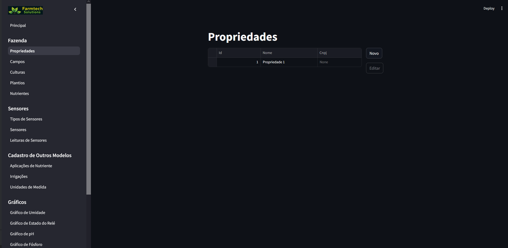
</p>

💡 Exemplo de consulta SQL para operação READ:
```sql
SELECT "PROPRIEDADE".id, "PROPRIEDADE".nome, "PROPRIEDADE".cnpj
FROM "PROPRIEDADE" ORDER BY "PROPRIEDADE".id
```

## Criação de dados (CREATE)
Para realizar uma operação de criação, basta o usário selecionar um dos modelos disponíveis no menu principal e clicar no botão "Novo". 
O sistema irá exibir um formulário para o usuário preencher os dados necessários. Esse formulário irá variar de acordo com o modelo selecionado.
O sistema irá validar os dados e realizar a operação no banco de dados.

<p align="center">
  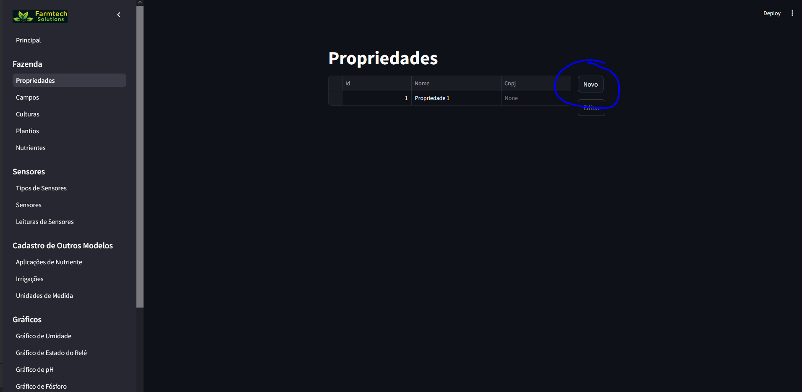
</p>

<p align="center">
  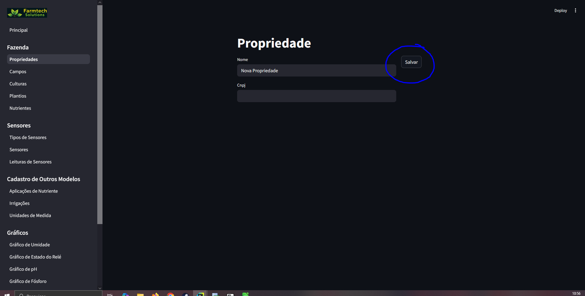
</p>

<p align="center">
  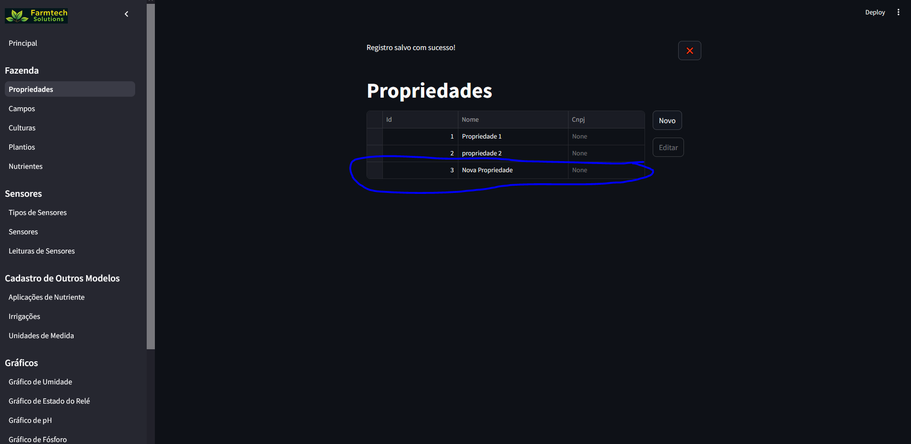
</p>

💡 Exemplo de operação CREATE:
```sql
INSERT INTO "PROPRIEDADE" (id, nome, cnpj) VALUES ("PROPRIEDADE_SEQ_ID".nextval, 'Nova Propriedade', NULL) RETURNING "PROPRIEDADE".id INTO :ret_0
```

## Atualização de dados (UPDATE)
Para realizar uma operação de atualização, basta o usário selecionar um dos modelos disponíveis no menu principal, selecionar uma das linhas e clicar no botão "Editar".
O sistema irá exibir um formulário com os dados cadastrados. O usuário pode alterar os dados e clicar no botão "Salvar" para atualizar o registro no banco de dados.

<p align="center">
  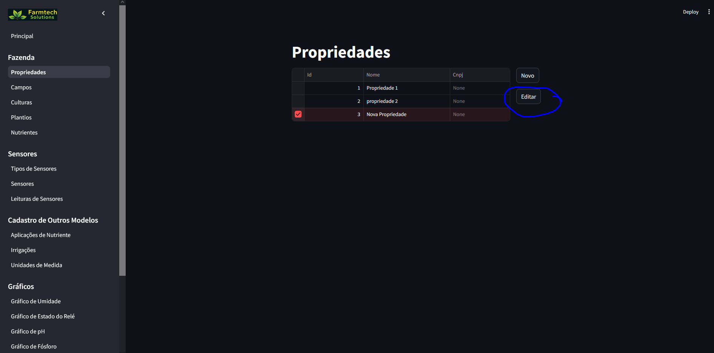
<p>

<p align="center">
  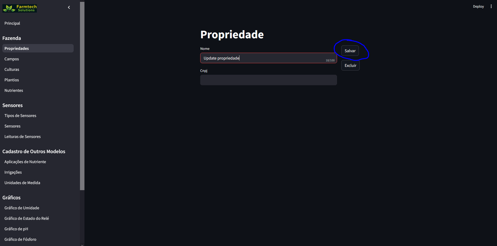
<p>

<p align="center">
  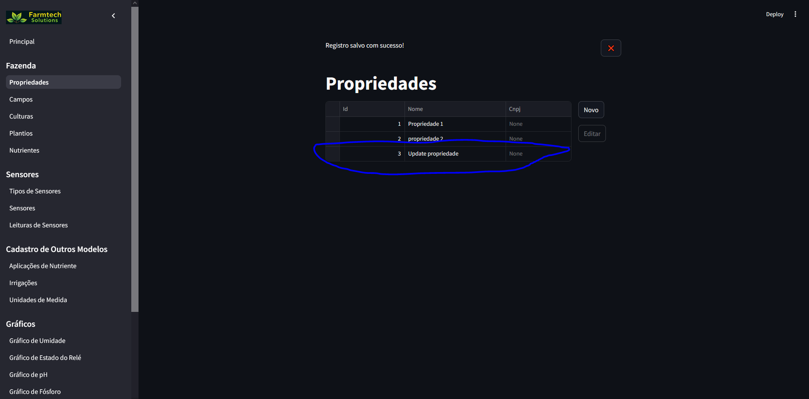
</p>


💡 Exemplo de operação UPDATE:
```sql
 UPDATE "PROPRIEDADE" SET nome='Update propriedade' WHERE "PROPRIEDADE".id = 3
```


## Exclusão de dados (DELETE)
Para realizar uma operação de exclusão, basta o usário selecionar um dos modelos disponíveis no menu principal, selecionar uma das linhas e clicar no botão "Editar" e posteriormente "Excluir".

<p align="center">
  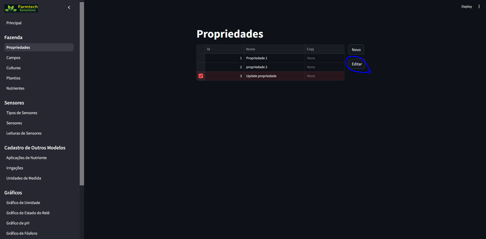
<p>

<p align="center">
  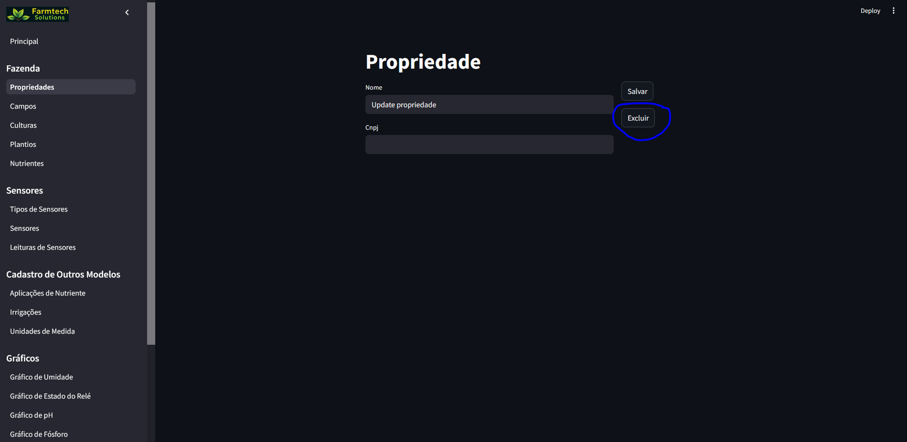
<p>

<p align="center">
  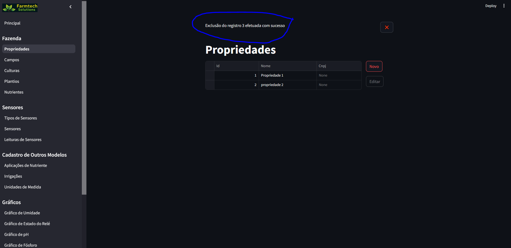
</p>

💡 Exemplo de operação DELETE:
```sql
DELETE FROM "PROPRIEDADE" WHERE "PROPRIEDADE".id = 3
```

## Importar Tabelas com os dados

As tabelas com os dados utilizados no sistema podem ser encontradas na pasta em `assets/database_export.zip`.

O arquivo zip contém os arquivos no formato CSV, que podem ser importados para o banco de dados utilizando o dashboard, conforme passos abaixo.

> **Nota:** Os dados das leituras do sensor estão datados de **15/05/2025** até **20/05/2025**.

1. O usuário deve selecionar a opção "Importar Banco de Dados" no menu principal.
<p align="center">
  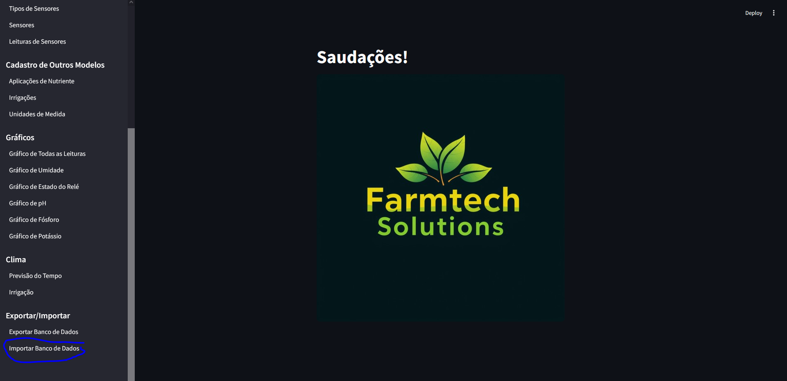
</p>

2. Selecione o arquivo ZIP localizado em `assets/database_export.zip`, espere carregar, role a página até o final e clique no botão "Salvar no Banco de Dados".
<p align="center">
  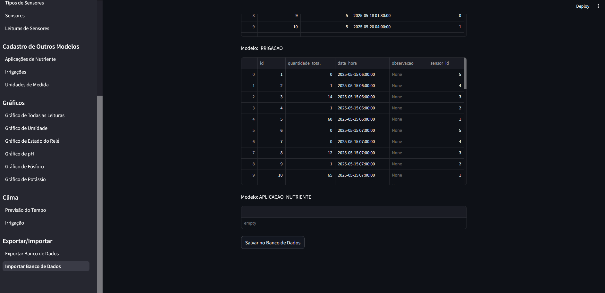
</p>

3. Não feche a janela e espere a operação ser concluída. Após a conclusão, o sistema irá exibir uma mensagem de sucesso. Caso ocorra algum erro, tente novamente.

<p align="center">
  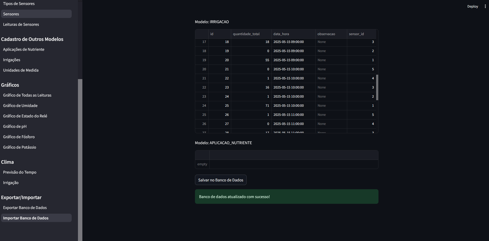
</p>

# Video demonstrando o funcionamento do circuito e lançamento manual dos dados no sistema em python
### Cap 1 - Construindo uma máquina agrícola

<div align="center">
  <a href="https://www.youtube.com/watch?v=HZI6EmQK8E8">
    
  </a>
</div>

    - link do vídeo: https://www.youtube.com/watch?v=HZI6EmQK8E8

### Ir Além 1: Dashboard em Python para Visualização dos Dados

O projeto inclui um dashboard desenvolvido em Python, utilizando a biblioteca Streamlit, que permite visualizar os dados armazenados no banco de dados de forma interativa e amigável. O dashboard apresenta gráficos e tabelas que facilitam a análise dos dados coletados pelos sensores.

## Atualizações de registro no Dashboard

Conforme solicitado no enunciado, o dashboard permite realizar atualizações de registro diretamente na interface. O usuário pode selecionar um registro, editar os dados e salvar as alterações, que serão refletidas no banco de dados.

Para atualizar a leitura de um sensor, o usario deverá selecionar a opção "Leituras de Sensores" no menu principal. Em seguida, o usuário pode clicar no botão "Editar" para modificar os dados de uma leitura específica.
Após realizar as alterações, o usuário deve clicar no botão "Salvar" para atualizar o registro no banco de dados, conforme mencionado nas operações CRUD.

<p align="center">
  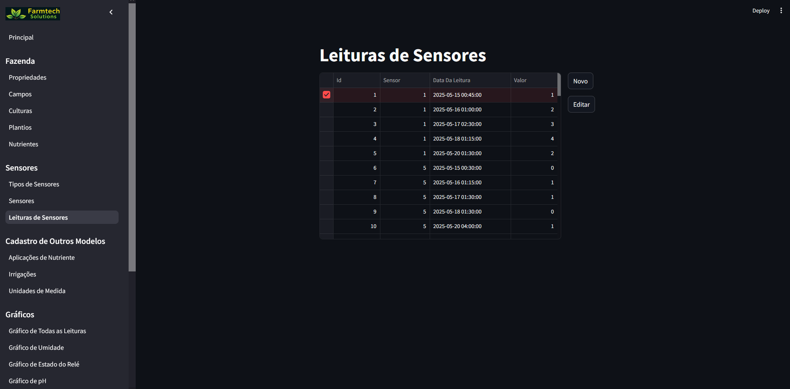
</p>

## Visualização de gráficos reais ou simulados

O dashboard também inclui gráficos que representam os dados coletados pelos sensores. Esses gráficos podem ser gerados a partir de dados reais ou simulados, dependendo da opção selecionada.

Para visualizar os gráficos o usuário deve selecionar uma das opções de "Gráficos" no menu principal. 
A seguir, o usario deverá selecionar o sensor ou sensores desejados, data inicial e data final.
Posteriormente, o usuário deve clicar no botão "Gerar Simulação" para visualizar dados simulados ou "Gerar Gráfico" para visualizar dados reais.

<p align="center">
  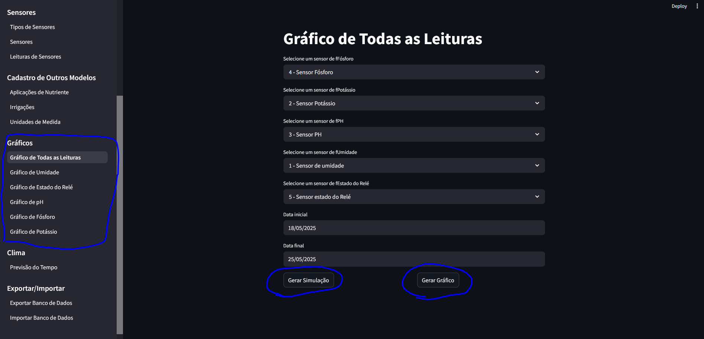
</p>
<p align="center">
  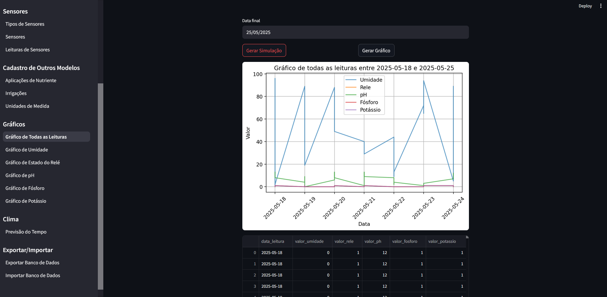
</p>

## Possíveis Erros que podem ocorrer durante a execução do sistema

- **Erro de Conexão com o Banco de Dados [WinError 10054]**: Caso ocorra este erro, a solução é clicar em outra opção do menu para que o sistema reinicie a conexão com o banco de dados.
<p align="center">
  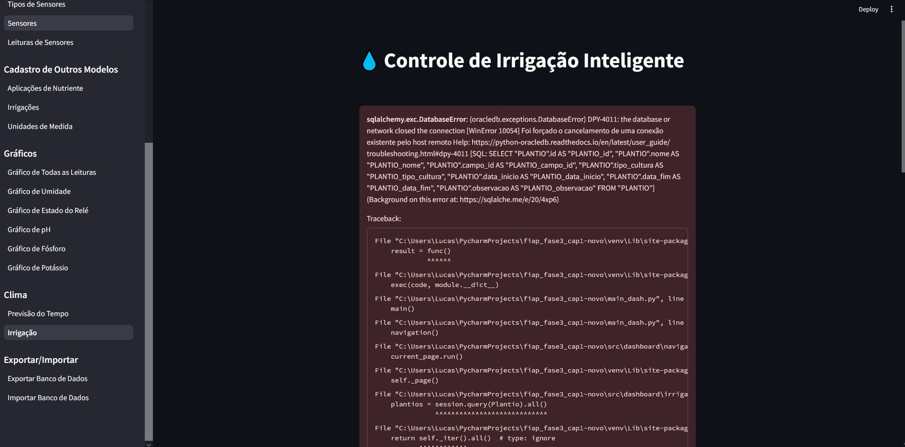
</p>

### Ir Além 2: Integração Python com API Pública

Para acessar a api o usuário deverá selecionar as opções "Previsão do Tempo" ou "Irrigação" no menu principal.

<p align="center">
  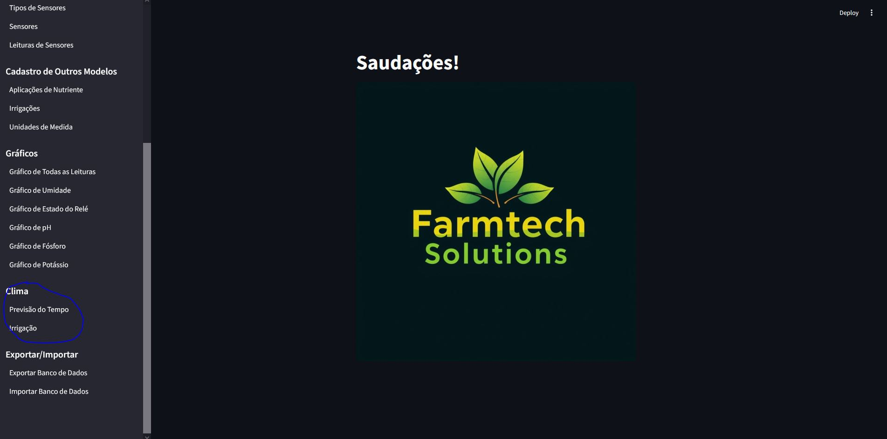
</p>

<p align="center">
  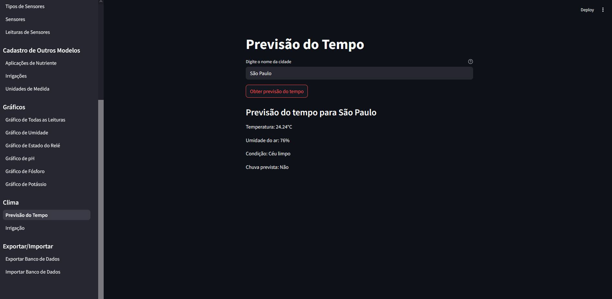
</p>

<p align="center">
  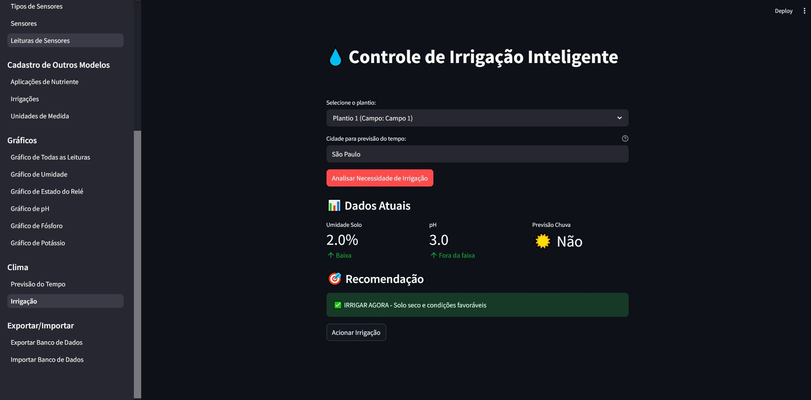
</p>


## Funcionamento API

#  1. Objetivo
  Fornecer dados meteorológicos para auxiliar na decisão de irrigação automática, integrando-se com sensores locais e o sistema de controle.

# 2. Endpoints Principais

  GET /previsao?cidade={cidade}
  Retorna:
  {
    "temperatura": 25.5,
    "umidade_ar": 65,
    "chuva": false,
    "condicao": "Ensolarado"
  }

# 3. Parâmetros de Decisão

  A API considera:
  Umidade do solo (<30% = irrigar)
  Previsão de chuva (se true = não irrigar)
  pH do solo (5.5 a 7.0 = ideal)

# 4. Fluxo Típico

  Sistema envia cidade do plantio
  API retorna condições climáticas
  Lógica local combina com dados de sensores
  Toma decisão de irrigação

# 5. Exemplo de Uso

  python
  dados = obter_dados_clima("Campinas")
  if not dados["chuva"] and umidade_solo < 30:
      acionar_irrigacao()

# 6. Requisitos
  Chave API válida
  Conexão internet
  Formato cidade: "Cidade,UF" (opcional)

# 7. Segurança
  Limite: 60 chamadas/minuto
  Dados criptografados em trânsito

## 8. Códigos de Erro

  401: Chave inválida
  404: Cidade não encontrada
  429: Limite excedido

## 📁 Estrutura de pastas

Dentre os arquivos e pastas presentes na raiz do projeto, definem-se:

- <b>.streamlit</b>: Pasta que contém arquivos de configuração do Streamlit, como o tema e a barra lateral.
- <b>assets</b>: Aqui estão os arquivos relacionados a elementos não-estruturados deste repositório, como imagens.
- <b>src</b>: Todo o código fonte criado para o desenvolvimento do projeto ao longo de todas as fases.
  - <b>dashboard</b>: Código do dashboard desenvolvido em Python, utilizando a biblioteca Streamlit. ([dashboard](src/dashboard/))
  - <b>database</b>: Execução dos comandos de banco de dados, como Conectar, Cadastrar, Listar, Editar e Excluir.
  - <b>logger</b>: Código responsável por registrar as operações realizadas no banco de dados, como inserções, atualizações e exclusões.
  - <b>service</b>: Conexão com a api pública de previsão do tempo, responsável por coletar dados meteorológicos.
  - <b>wokwi</b>: Código do ESP32, responsável por monitorar a necessidade de irrigação em uma plantação, simulando sensores de nutrientes e condições ambientais.
- <b>README</b>: arquivo que serve como guia e explicação geral sobre o projeto (o mesmo que você está lendo agora).
- <b>main_dash</b>: arquivo principal do dashboard, onde o código é executado. Ele foi colocado nesta localização para evitar problemas com imports

## 🗃 Histórico de lançamentos

* 0.1.2 - 20/05/2025  - Atualizações finais no readme e correção de bugs
* 0.1.1 - 18/05/2025  - Atualizações do readme, melhorias no código e correção de bugs
* 0.1.0 - 16/05/2025  - Versão preliminar da nossa aplicação

## 📋 Licença

<p xmlns:cc="http://creativecommons.org/ns#" xmlns:dct="http://purl.org/dc/terms/"><a property="dct:title" rel="cc:attributionURL" href="https://github.com/agodoi/template">MODELO GIT FIAP</a> por <a rel="cc:attributionURL dct:creator" property="cc:attributionName" href="https://fiap.com.br">Fiap</a> está licenciado sobre <a href="http://creativecommons.org/licenses/by/4.0/?ref=chooser-v1" target="_blank" rel="license noopener noreferrer" style="display:inline-block;">Attribution 4.0 International</a>.</p>
